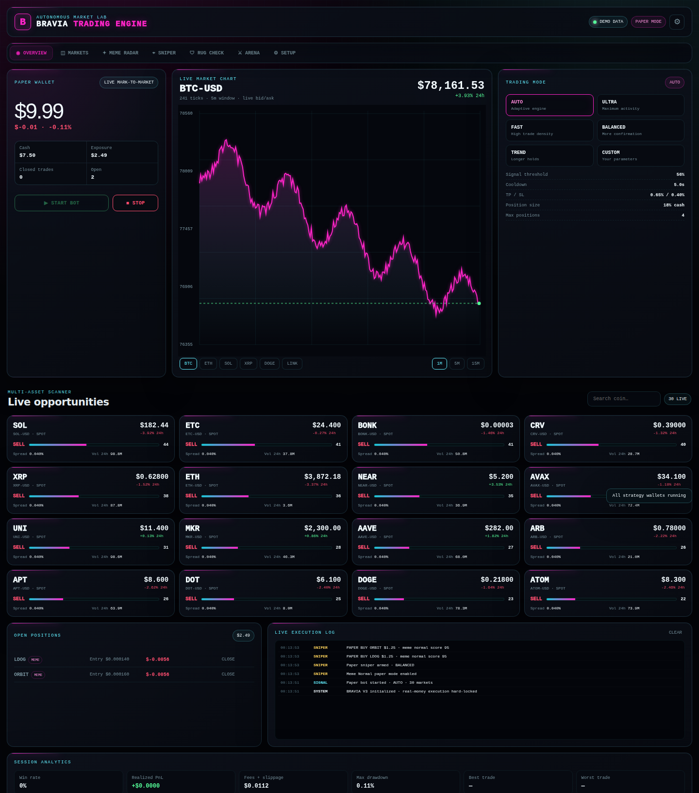
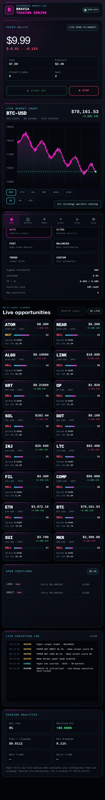
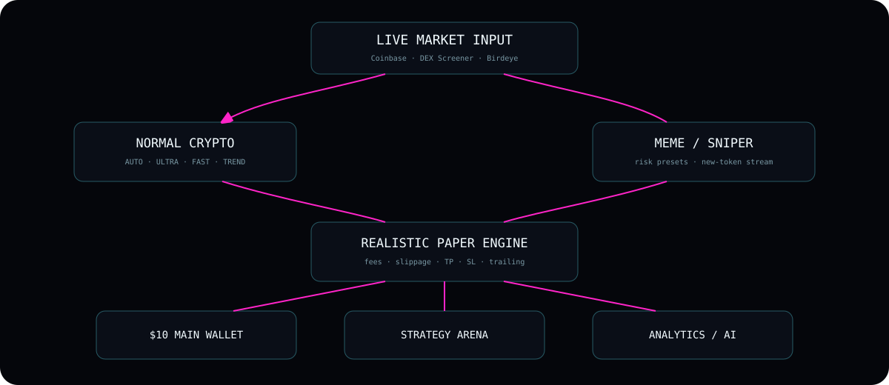

<div align="center">

# ⚡ BRAVIA TRADING ENGINE
### Live market radar · realistic paper execution · Solana meme scanner · sniper lab · RugCheck · Strategy Arena

**V3 · PAPER-FIRST · MOBILE READY**





> ✅ Real screenshots generated by the browser QA suite after testing the shipped dashboard at desktop and iPhone-sized viewports.

</div>

---

## 🟢 Current build status

| System | Status | What it does |
|---|---|---|
| Normal crypto engine | ✅ | Discovers/scans up to ~80 Coinbase USD spot markets and consumes live ticker data |
| FAST / ULTRA | ✅ | Much shorter cooldowns and higher trade density than V1 |
| Live charts | ✅ | Rescaled canvas chart with grid, price labels, current-price line and 1m/5m/15m windows |
| Mobile UI | ✅ | Dedicated iPhone layout + fixed bottom navigation + responsive cards/tables |
| Paper wallet | ✅ | Unified normal-crypto + memecoin simulated portfolio |
| Fees / slippage | ✅ | Configurable paper assumptions included in fills and analytics |
| Meme Radar + Normal mode | ✅ | Public DEX Screener fallback, automatic paper mode + backend upgrade path |
| Sniper Lab | ✅ | SAFE / BALANCED / FAST / EXPERIMENTAL presets, paper auto-entry and automatic exits |
| Real-time new-token path | ✅* | Birdeye WebSocket → BRAVIA backend → browser SSE when API key/backend are configured |
| RugCheck Lab | ✅ | Paste a Solana CA and receive liquidity/flow/risk analysis; richer results with backend security APIs |
| Strategy Arena | ✅ | Eight isolated $10 virtual wallets test normal, meme and sniper strategies in parallel |
| Persistence | ✅ | Paper analytics and arena state persist locally between refreshes |
| AI Supervisor | ✅* | Optional OpenAI backend review of paper results; never sits in the low-latency execution loop |
| Wallet connect | ✅ | Read-only public-address connection for a compatible Solana browser wallet |
| Autonomous live-money execution | 🔒 | **Intentionally disabled** in this release |

`*` Requires the optional backend and provider API key(s).

---

## 🧠 What BRAVIA actually does

```text
                 ┌─────────────────────┐
                 │  LIVE MARKET INPUT  │
                 └──────────┬──────────┘
                            │
          ┌─────────────────┴─────────────────┐
          │                                   │
  Coinbase normal crypto             Solana meme universe
  live ticker + products          DEX Screener / Birdeye stream
          │                                   │
          ▼                                   ▼
   Signal Engine                      Risk / Meme Engine
          │                                   │
   AUTO / ULTRA / FAST             Normal / Sniper presets
          │                                   │
          └──────────────┬────────────────────┘
                         ▼
                Realistic Paper Engine
                fees + slippage + exits
                         │
            ┌────────────┴────────────┐
            ▼                         ▼
       Main $10 wallet          Strategy Arena
            │                  isolated $10 wallets
            ▼                         ▼
       Dashboard / logs / analytics / AI review
```

### Normal-crypto signals

The browser scores observable market features such as short momentum, acceleration, 24-hour direction, spread and short-term volatility. The score is not presented as magical “AI confidence.” `ULTRA` and `FAST` intentionally use lower thresholds and shorter cooldowns so they generate more paper trades and can be compared against slower modes.

### 🎯 Sniper

There are two operating paths:

**Public fallback**

```text
DEX Screener fresh token profiles
        ↓
fetch Solana pair metrics
        ↓
score liquidity / age / activity / flow
        ↓
preset pass?
        ↓
PAPER BUY → TP / SL / trailing / max hold
```

**Real-time backend path**

```text
Birdeye SUBSCRIBE_TOKEN_NEW_LISTING
        ↓
BRAVIA backend receives event
        ↓
DEX pair / liquidity is resolved
        ↓
SSE pushes candidate to browser
        ↓
filters run immediately
        ↓
PAPER BUY when preset passes
```

A newly created token is **not automatically tradable or safe**. BRAVIA waits for usable market/pool data and applies the configured filters.

---

## 🛡 RugCheck Lab

Paste a Solana contract address and BRAVIA evaluates available signals including:

- 💧 liquidity
- ⏱ pair age
- 🔄 5-minute transaction activity
- 🟢 buy/sell flow
- 📊 volume
- 💰 market-cap/liquidity relationship
- 👥 holder concentration when Birdeye backend data is available
- 👨‍💻 developer/insider cohorts when available
- 🧊 freeze/mint or other security flags when GoPlus/Birdeye return them

The output is deliberately phrased as **preliminary pass / caution / high risk**, not “100% safe.” A rug detector can reduce risk; it cannot guarantee a token will not rug.

---

## ⚔ Strategy Arena — “Test All Modes”

Eight independent strategies can run together:

1. 🤖 Auto Adaptive
2. ⚡ Ultra Scalp
3. 🏎 Fast Density
4. ⚖ Balanced
5. 📈 Trend Rider
6. 🐸 Meme Normal
7. 🛡 Sniper Safe
8. 🎯 Sniper Fast

Each starts with **$10 independently**, so the leaderboard compares strategy quality instead of letting one mode steal another mode's capital.

The board tracks:

- equity
- PnL
- completed trades
- win rate
- max drawdown
- BRAVIA comparison score

---

## ✦ AI Supervisor

The optional supervisor receives **aggregated paper-session statistics**, not wallet secrets and not a firehose of every market tick. It is designed to answer questions such as:

- Which mode looks strongest after accounting for drawdown?
- Is trade density causing excessive friction?
- Is the sample size too small to trust?
- What parameter deserves another paper test?

It is intentionally **not** used to make millisecond sniper decisions. Low-latency execution stays deterministic and event-driven.

---

## 📱 iPhone

The GitHub Pages frontend is designed to work directly in Safari:

- responsive one-column primary layout
- large chart area
- compact two-column market cards
- persistent bottom navigation
- touch-sized controls
- no desktop-only hover dependency
- installable web-app manifest

> Safari/iOS may suspend a webpage in the background. A true unattended 24-hour test therefore belongs on the backend/server rather than relying on an iPhone tab staying alive.

---

## 🔌 APIs

See **[`docs/API_SETUP.md`](docs/API_SETUP.md)** for exact setup.

| Provider | BRAVIA role |
|---|---|
| Coinbase Advanced Trade | live normal-crypto market data |
| DEX Screener | public Solana token/pair/liquidity fallback |
| Birdeye | real-time new-token stream + holder intelligence |
| GoPlus | Solana token-security enrichment |
| Helius | Solana RPC/read layer |
| Jupiter Swap V2 | Solana route/order quote modelling |
| OpenAI | optional paper-session supervisor |

The API keys for Birdeye, GoPlus, Helius, Jupiter and OpenAI belong **only on the backend**.

---

## 🔐 Wallet / real-money mode

On startup BRAVIA asks whether the user wants **Paper Trading** or **Live Wallet**.

The Live Wallet option currently operates as a **safety preview**:

- ✅ can request connection from an injected compatible Solana wallet
- ✅ sees the approved public address
- ✅ never requests a seed phrase
- ❌ cannot autonomously sign a transaction
- ❌ cannot execute a real-money swap

Read [`docs/LIVE_WALLET.md`](docs/LIVE_WALLET.md) for the architecture and safety boundary.

The server itself contains a hard lock:

```js
const LIVE_EXECUTION_ENABLED = false;
```

---

## 🚀 Run

### Frontend

The frontend is static and can be hosted by GitHub Pages. No build step is required.

### Backend

```bash
cd server
npm install
npm start
```

Or deploy `server/Dockerfile` to a Docker/Node host and configure its environment variables privately.

---

## ✅ Review checklist performed

- [x] JavaScript syntax checked with Node
- [x] backend syntax checked with Node
- [x] every `$('id')` JavaScript reference checked against the HTML DOM
- [x] no duplicate HTML IDs
- [x] browser secret keys intentionally absent
- [x] reconnect logic retained for Coinbase
- [x] public data fallback preserved when optional backend is unavailable
- [x] DEX Screener polling kept below documented public rate-limit ceilings
- [x] mobile breakpoints added at 1100 / 760 / 430 px
- [x] charts rescale from actual visible tick range rather than plotting raw prices against a fixed canvas
- [x] paper assumptions are configurable and explicitly labelled
- [x] live-money signing endpoint absent

---

<div align="center">

### 🌌 Architecture map



**BRAVIA // V3**  
*Build the simulator first. Measure it. Break it. Improve it. Only trust what survives testing.*

</div>

---

## 🧪 Verified release QA

Before promotion to `main`, BRAVIA V3 was tested in a real headless Chromium browser at **1440×1050 desktop** and **393×852 iPhone-sized** viewports. The suite opened Paper mode, started the bot, rendered the chart, navigated the major views, enabled Meme Normal, armed FAST Sniper and launched all eight Strategy Arena wallets.

- ✅ JavaScript syntax: PASS
- ✅ Backend syntax: PASS
- ✅ Missing HTML/JS element references: 0
- ✅ Duplicate HTML IDs: 0
- ✅ Desktop browser errors: 0
- ✅ Mobile browser errors: 0
- ✅ Desktop chart: 634×317 in QA viewport
- ✅ Mobile chart: 351×245 in QA viewport
- ✅ Strategy Arena wallets rendered: 8
- ✅ Overall browser smoke test: PASS

Exact reports live under [`docs/qa/`](docs/qa/). This verifies the tested UI/code path; it does not guarantee trading profitability or third-party API uptime.
